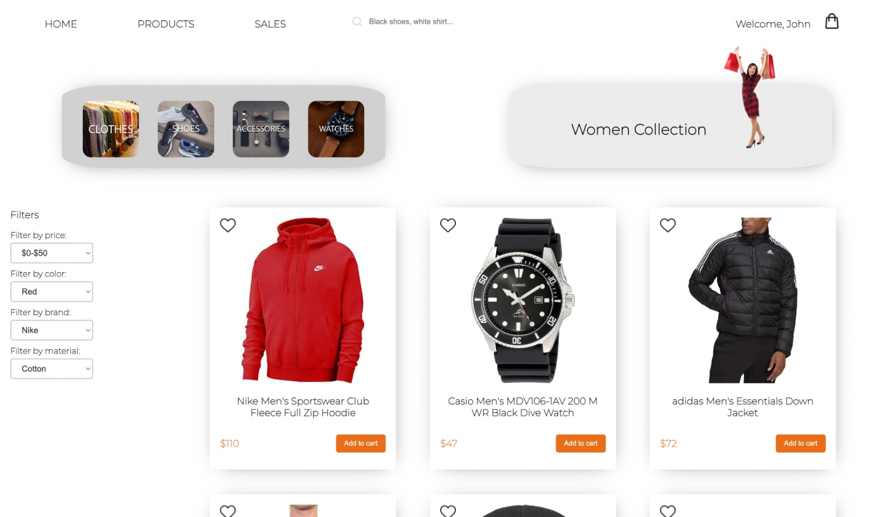

# shoppero-frontend

Shoppero Ecommerce Website
Welcome to Shoppero, a modern ecommerce website that allows users to browse products, search and filter products, add products to cart, favorite products, checkout (without payment), and much more. This website uses HTML, CSS, vanilla PHP, and JavaScript, with MySQL as the database. In this README, we will provide a thourough overview of the different aspects of this project.

## Team Members

- Ayman Hajjar - Team Leader
- Shifaa Khalil
- Salman Moussa
- Mohamad Shoumar

## Color Palette

- #FFA500 (Orange)
- #FFD166 (Yellow)

## User Stories

- As a customer, I want to be able to create and access my account so that I can make purchases and save my favorite items.
- As a customer, I want to be able to reset my password on an online shopping website if I forget it, so that I can regain access to my account.
- As a customer searching for a product, I need to be able to have a look at all the items, so that I am likely to find what I am looking for.
- As a customer, I want to be able to mark my favorite products so that I can easily find and keep track of them for future reference.
- As a customer, I want to be able to edit my profile information so that I can update my shipping address.
- As a customer, I want to be able to add an item to my cart so that I can order multiple items at the same time.
- As a customer, I want to be able to view detailed information about a product so that I can make an informed decision about whether to purchase the product.
- As a customer, I want to check my cart so I can make adjustments prior to checkout.
- As a customer, I want to be able to complete the checkout process on an online shopping website so that I can purchase the products in my cart and have them delivered to me.

## Admin Stories

- As an admin, I want to be able to add, edit, and remove products so that I can manage the product inventory and ensure that the website offers up-to-date and accurate product information.

- As an admin, I want to be able to view and manage the user accounts so that I can ensure that the website is providing a safe and secure user experience.

## Wireframes

## Implementation

| Section         | Screenshot                                |
| --------------- | ----------------------------------------- |
| Home Page       |            |
| Product Page    |     |
| Login Page      |          |
| Signup Page     |      |
| Product Details |  |

## How to Run

### Prerequisites:

- A local development environment (e.g. XAMPP, MAMP, WAMP, LAMP) installed on your machine
- MySQL installed and running on your machine
- Git installed on your machine

### Steps:

1. Open your terminal and navigate to the directory where you want to clone the project.
2. Replace your-username with your GitHub username.
3. Navigate into the project directory
4. port the shoppero.sql file into your MySQL database. You can use a tool like phpMyAdmin or the MySQL command line to do this.
5. Open the config.php file in the includes directory and update the database configuration values to match your local environment.
6. Start your local development environment and navigate to the project in your web browser.
